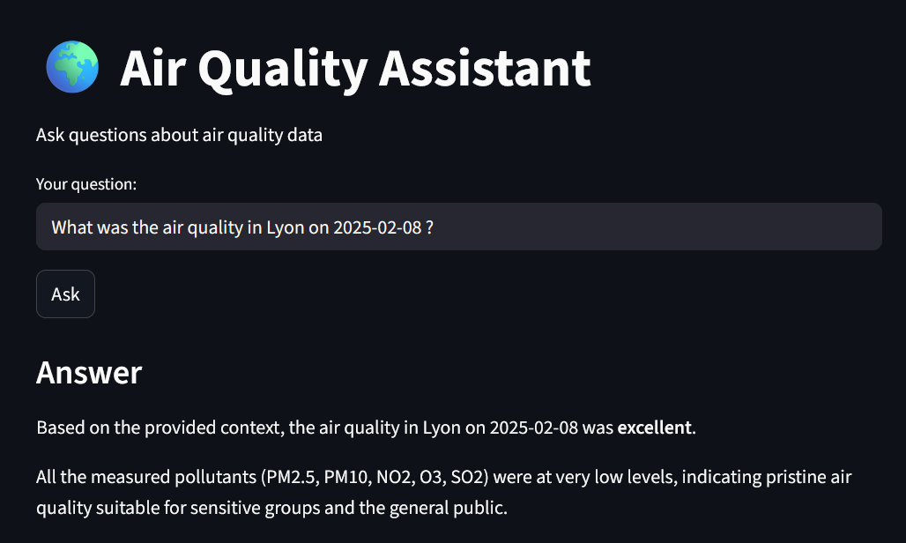

# AI assistant for air quality



The aim of this project is to create an **AI agent** that answers questions about air quality in different cities or neighbourhoods. 
The air quality data is sourced from [Atmo France](https://admindata.atmo-france.org/api/doc/v2). 
This data is indexed to answer questions using a **RAG (Retrieval-Augmented Generation)** method. 

The first step involves processing the data to generate embeddings. I transformed the data to produce sentences such as:
```
‘On {date} in {city}, the air quality was: PM2.5 = {pm25}, PM10 = {pm10}, NO2 = {no2}, O3 = {o3} and SO3 = {so3}.’.
```

To generate the embeddings, I used ```all-MiniLM-L6-v2``` because it's a distilled version of larger models like BERT, making it faster and less ressource intensive, it performs weel on sentence similarity task and it is also open source  (it's part of the Sentence-Transformers Library.

I then indexed the embeddings using **FAISS**. But you can also use **LangChain**. 

To generate the responses, I used ```deepseek-r1:8b``` as the LLM. As I have an AMD graphics card and am using Windows, I loaded the model using ```Ollama```. ```deepseek-r1:8b``` has the advantage to be a strong open-source model, competitive with smaller LLMs like ```llama2:70b```.
